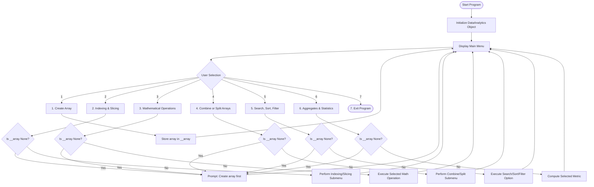
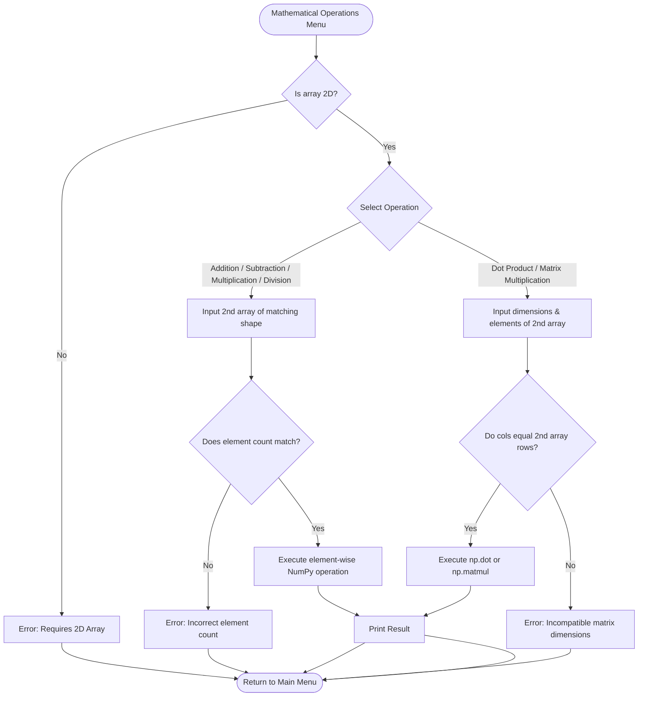

# NumPy Analyzer

A robust, object-oriented interactive CLI application written in Python using **NumPy** for array manipulation, linear algebra, array combination/splitting, searching/sorting/filtering, and statistical analysis.

---

## Table of Contents
- [Features](#features)
- [Architecture & Class Overview](#architecture--class-overview)
- [Flowcharts](#flowcharts)
  - [Application Flowchart](#application-flowchart)
  - [Mathematical Operations Flowchart](#mathematical-operations-flowchart)
- [Installation & Setup](#installation--setup)
- [Usage Guide](#usage-guide)
- [Method Summary](#method-summary)
- [License](#license)

---

## Features

- **Array Creation**: Supports creating 1D, 2D, and 3D arrays dynamically from user input.
- **Indexing & Slicing**: Navigate elements or extract sub-matrices (2D) with start:end range controls.
- **Mathematical Operations**: Perform matrix addition, subtraction, multiplication, division, dot product, and matrix multiplication (`matmul`).
- **Combine & Split**: Concatenate 2D arrays along vertical axes or split arrays into equal parts.
- **Search, Sort & Filter**: Flat array searching via `np.where`, ascending/descending sorting, and boolean condition filtering.
- **Statistical Analytics**: Calculate sum, mean, median, standard deviation, variance, min, max, percentiles, and Pearson correlation coefficients.
- **OOP Paradigm**: Built using encapsulation, class methods, and static methods.

---

## Architecture & Class Overview

```
DataAnalytics (Class)
│
├── Encapsulated Property
│   └── __array (Private NumPy NDArray)
│
├── Array Management
│   └── create_array()
│   └── indexing_slicing()
│
├── Mathematics & Transformations
│   └── mathematical_operations()
│   └── combine_split()
│
├── Searching & Statistics
│   └── search_sort_filter()
│   └── statistics()
│
└── Utility & Execution
    ├── run()
    ├── from_list(values) [@classmethod]
    └── show_project_info() [@staticmethod]
```

---

## Flowcharts

### Application Flowchart



---

### Mathematical Operations Flowchart



---

## Installation & Setup

### Prerequisites
- Python 3.8 or higher
- `pip` package manager

### Setup Steps
1. Clone or download the repository to your local machine:
   ```bash
   git clone https://github.com/amrawat0110-ctrl/numpy-analyzer.git
   cd numpy-analyzer
   ```

2. Install the required dependencies:
   ```bash
   pip install numpy
   ```

3. Run the application:
   ```bash
   python numpy_analyzer.py
   ```

---

## Usage Guide

1. **Creating an Array**: Run option `1` from the main menu and follow the prompts to specify dimensions (1D, 2D, 3D) and enter numeric values.
2. **Indexing & Slicing**: Choose option `2` to extract individual elements using zero-based indices or sub-matrices using range slicing (e.g., `0:2` for rows and `1:3` for columns).
3. **Performing Matrix Math**: Use option `3` to perform linear algebra operations. Ensure matching array sizes for element-wise operations or dimension alignment for dot/matmul operations.
4. **Statistical Analysis**: Option `6` provides instant summary statistics including mean, variance, standard deviation, and correlation calculations with a second array.

---

## Method Summary

| Method | Description |
| :--- | :--- |
| `__init__(array=None)` | Constructor to initialize private `__array` attribute. |
| `create_array()` | Dynamic menu for creating 1D, 2D, or 3D NumPy arrays. |
| `indexing_slicing()` | Zero-based element lookup and 2D sub-array slicing. |
| `mathematical_operations()` | Matrix arithmetic, `np.dot`, and `np.matmul`. |
| `combine_split()` | Vertical concatenation and split functionality. |
| `search_sort_filter()` | `np.where` search, sorting, and boolean filter masking. |
| `statistics()` | Summary stats (mean, median, std, var, percentile, corrcoef). |
| `from_list(values)` | Class method alternative constructor. |
| `show_project_info()` | Static method to print project banner details. |

---

## 👨‍💻 Author

**Armin Khareghat**  
B.Sc. Computer Science  
🤖 AI / ML & Data Science  

---

## License

This project is open-source and available under the [MIT License](LICENSE).

---

⭐ If you found this project useful, consider giving the repository a star!

